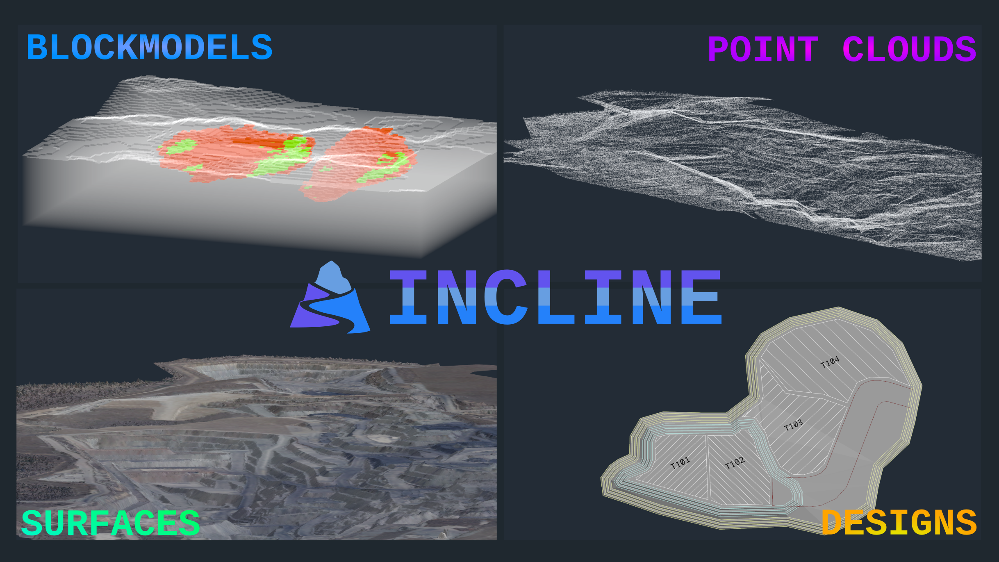

# Incline

[Incline](https://inclinedesign.net/) is a free open-source mine design application that makes mine design accessible for those who do not wish to be bound by expensive and restrictive licences.

Cross-platform, lightweight, and built for mining professionals. Incline is free for everyone.

## Getting Started

Check out the [releases page](https://inclinedesign.net/downloads/) and grab the latest version of Incline!

## Features

- Design-strings editing for points, circles, poly-lines, and text.
- Design tools including offset, auto-bench, chamfer, relimit, fuse, polygon explosion, and bezier.
- Triangulation loading, viewing, and editing.
- Block model generation, viewing and filtering.
- Cross-platform desktop target: Web Assembly, Windows, Linux, and macOS.
- DXF and OMF compatibility for exchanging design-strings with other CAD and mine planning tools.

## Example data

The [`examples`](examples/) directory contains small, import-ready block-model, drillhole, triangulation, point-cloud, and orthophoto datasets.

## License

Incline is licensed under the GNU General Public License. See [LICENSE](LICENSE.md) for the full terms.

## Maintainers

- **Leo Timmins** github: *leotimmins1974* email: `leo@inclinedesign.net`
- **Lucas Timmins** github: *trimental* email: `lucas@inclinedesign.net`
